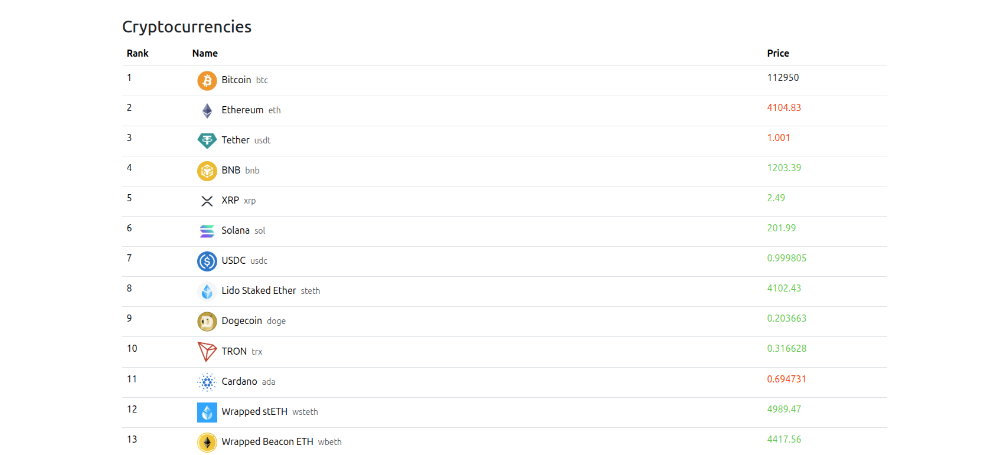

# Django Channels + React + Celery + Redis: Real-Time Crypto Table 

Educational project built to practice real-time data updates.

This project is a real-time cryptocurrency prices table built with **Django Channels**, **Celery**, **Redis**, and **React**.  
It performs periodic data fetching from the **CoinGecko API** every 10 seconds and broadcasts updates to all connected clients via **WebSockets**.

- **Backend:** Django, Channels, Celery, Redis  
- **Frontend:** React  
- **Data:** CoinGecko API, updated every 10 seconds via WebSockets  

